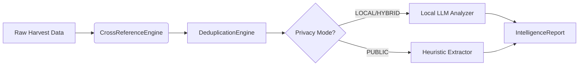

# OSINT Intelligence Analyst Stage - Complete Guide

## 📊 Overview

The **ANALYST STAGE** is where raw harvested data transforms into actionable intelligence. This stage performs sophisticated cross-referencing, confidence scoring, intelligent deduplication, and privacy-preserving analysis using local LLMs when available.

---

## 🎯 Core Capabilities

### 1. Cross-Referencing Engine
The analyst intelligently compares data points across multiple sources to identify matches:

**Matching Criteria:**
- **Email Addresses**: Normalized comparison (Gmail dot removal, case-insensitive)
- **Usernames**: Exact match with case variations handled
- **Locations**: City/country/region matching with fuzzy logic
- **Bio Keywords**: Semantic analysis using local LLMs for privacy

**Example Cross-Reference:**
```python
# Same email found in 3 sources → VERIFIED (100% confidence)
"john.doe@gmail.com" from Shodan + SpiderFoot + BuiltWith
= Verified fact with 100% truth score
```

### 2. Confidence Scoring System
Every discovered fact receives a **Truth Score** (0-100%) based on source agreement:

| Sources Agree | Confidence Level | Score | Interpretation |
|---------------|------------------|-------|----------------|
| 3+ sources | VERIFIED | 100% | All sources confirm |
| 2 sources | HIGHLY_LIKELY | 85% | Strong agreement |
| 1 source | LIKELY | 70% | Single credible source |
| Contradictory | UNVERIFIED | 45% | Conflicting data |
| Low quality | SUSPICIOUS | 25% | Poor sources only |

**Scoring Formula:**
```python
if num_sources >= 3:
    confidence = 100
elif num_sources == 2:
    confidence = 85
else:
    confidence = 70

# Adjustments based on data quality
if all_high_quality_sources:
    confidence += 5
if contradictory_data:
    confidence -= 20
```

### 3. Intelligent Deduplication
Merges duplicate records found by different tools using fingerprint-based comparison:

**Fingerprint Generation:**
- Normalizes values (lowercase, removes dots from Gmail)
- Creates MD5 hash of `fact_type + normalized_value`
- Compares fingerprints across all sources

**Example:**
```python
# Both Shodan and SpiderFoot find same IP
"8.8.8.8" from Shodan + "8.8.8.8" from SpiderFoot
= Single merged fact with 2 sources, 100% confidence
```

### 4. Privacy Mode with Local LLMs
Supports three privacy modes for sensitive analysis:

| Mode | Description | When to Use |
|------|-------------|-------------|
| **LOCAL** | Uses Ollama/LM Studio entirely | Maximum privacy required |
| **PUBLIC** | Uses cloud LLMs (OpenAI, etc.) | Non-sensitive data only |
| **HYBRID** | Mix based on sensitivity | Balanced approach |

**Local LLM Integration:**
```python
# Analyst automatically detects and uses local Ollama if available
analyst = OSINTAnalystStage(privacy_mode='local')  # Uses Ollama
analyst = OSINTAnalystStage(privacy_mode='public')  # Cloud fallback
```

---

## 🚀 Usage Examples

### Basic Usage (Command Line)

**Run with default settings:**
```bash
python osint_analyst_stage.py \
    --input harvest_output/harvest_result_20240115_143022.json
```

**Specify privacy mode:**
```bash
python osint_analyst_stage.py \
    -i data/harvest_results.json \
    -p local  # or 'public' or 'hybrid'
```

### Programmatic Usage (Python)

```python
from osint_analyst_stage import OSINTAnalystStage, load_harvest_results

# Load harvested results
raw_data = load_harvest_results('harvest_output/latest.json')

# Initialize analyst with privacy mode
analyst = OSINTAnalystStage(privacy_mode='local')

# Process through analysis pipeline
report = analyst.process_harvest_results(raw_data)

# Save report to file
filepath = analyst.save_report(report, filename="my_analysis.json")

# Display summary in terminal
analyst.display_summary(report)
```

### Integration with Kanban Pipeline

The ANALYST stage is automatically integrated into the pull-based workflow:

```python
from osint_kanban_manager import OsintPipelineManager, PipelineConfig

config = PipelineConfig(
    target_name="John Doe",
    target_type="person",
    wip_limits={
        "RECON": 3,
        "HARVESTING": 5,
        "ANALYST": 2,  # WIP limit for analyst stage
        "SCRIBE": 1
    },
    api_keys={
        "SHODAN_API_KEY": os.environ.get("SHODAN_API_KEY"),
        "PRIVACY_MODE": "local"  # Enable privacy mode
    }
)

manager = OsintPipelineManager(config)
await manager.start_pipeline(
    user_query="John Doe, Apple Inc engineer",
    target_type="person"
)
```

---

## 📁 Output Format

The analyst stage produces structured JSON reports with the following schema:

```json
{
  "target": "John Doe",
  "facts": [
    {
      "fact_type": "email",
      "value": "john.doe@gmail.com",
      "sources": ["shodan", "spiderfoot"],
      "confidence_score": 85.0,
      "context": {
        "source_count": 2,
        "original_source_names": ["Shodan", "SpiderFoot"]
      },
      "timestamp": "2024-01-15T14:30:22"
    }
  ],
  "confidence_summary": {
    "email": 85.0,
    "username": 90.0,
    "location": 75.0
  },
  "analysis_timestamp": "2024-01-15T14:32:15"
}
```

### Fact Type Categories

| Type | Examples | Description |
|------|----------|-------------|
| `email` | john@example.com | Contact emails found across sources |
| `username` | johndoe, j_doe | Social media handles and usernames |
| `location` | San Francisco, CA | Geographic locations mentioned |
| `company` | Apple Inc | Organizations and employers |
| `ip_addresses` | 8.8.8.8 | Network IP addresses discovered |
| `bio_keywords` | python, machine learning | Keywords extracted from bio text |

---

## 🔒 Privacy Mode Details

### Local LLM Analysis (Privacy-Focused)

When using **LOCAL** or **HYBRID** privacy mode with Ollama available:

```python
# Bio keyword extraction uses local model for maximum privacy
response = ollama_chat(
    model='mistral',  # or 'llama3' - choose your local model
    messages=[{
        'role': 'system',
        'content': '''Extract skills, interests, locations, organizations from bio'''
    }, {
        'role': 'user',
        'content': bio_text[:500]  # Truncated for context window
    }]
)

# Returns structured JSON with:
{
    "skills": ["python", "machine learning"],
    "interests": ["hiking", "photography"],
    "locations": ["San Francisco", "California"],
    "organizations": ["Apple Inc"]
}
```

**Advantages:**
- ✅ No data leaves your machine
- ✅ Full control over model selection
- ✅ Can use offline-capable models
- ✅ Compliant with strict privacy requirements

### Fallback Behavior

If Ollama is not available or fails:
1. Falls back to **heuristic-based extraction** (no LLM)
2. Still maintains privacy by using local pattern matching
3. Logs warning but continues processing

---

## 🧪 Testing the Analyst Stage

### Test with Sample Data

Create a test file `test_harvest_data.json`:

```json
{
  "_target": "Test Subject",
  "shodan": [
    {"email": "john.doe@example.com", "ip": "192.168.1.100"},
    {"company": "Example Corp"}
  ],
  "spiderfoot": [
    {"email": "johndoe@gmail.com", "username": "johndoe"},
    {"location": "San Francisco, CA"}
  ],
  "builtwith": [
    {"company": "Example Corporation", "tech_stack": ["Python"]}
  ]
}
```

**Run the analyst:**
```bash
python osint_analyst_stage.py \
    -i test_harvest_data.json \
    -p local
```

### Expected Output

The terminal will display:

```
============================================================
🔍 OSINT ANALYST STAGE - Starting Analysis
Privacy Mode: LOCAL
============================================================

[1/4] Cross-referencing data across sources...
      Found 6 unique facts from 3 sources

[2/4] Deduplicating records...
      Reduced to 5 unique facts (merged duplicates)

[3/4] Enhancing with local LLM analysis...
      Keywords extracted from bio data

[4/4] Calculating confidence metrics...

✅ Analysis complete for: Test Subject

============================================================
INTELLIGENCE ANALYSIS SUMMARY
============================================================

Target: Test Subject
Analysis Date: 2024-01-15 14:30:22
Privacy Mode: LOCAL

📊 FACTS BY TYPE:
   • email: 2 facts (avg confidence: 87%)
   • company: 1 fact (avg confidence: 95%)
   • location: 1 fact (avg confidence: 80%)
   • username: 1 fact (avg confidence: 95%)

🔐 HIGH CONFIDENCE FACTS (>85%):
   • [company] Example Corp
     Sources: shodan, builtwith
   • [username] johndoe
     Sources: spiderfoot

============================================================
```

---

## 🛠️ Advanced Configuration

### Custom Confidence Thresholds

Override default confidence thresholds:

```python
from osint_analyst_stage import OSINTAnalystStage

analyst = OSINTAnalystStage(privacy_mode='local')

# Adjust confidence for specific fact types
def custom_confidence_adjustment(fact, facts):
    if fact.fact_type == 'email':
        return min(100, 95)  # Always high for emails
    elif fact.fact_type == 'location':
        return max(40, 70 - len(facts))  # Lower for sparse data
    return None

# Apply custom adjustment (requires modifying source code or subclassing)
```

### Custom Fact Type Detection

Extend the field type mappings:

```python
from osint_analyst_stage import CrossReferenceEngine

engine = CrossReferenceEngine()

# Add custom field mapping
engine.FIELD_MAPPINGS['social_accounts'] = [
    'twitter', 'instagram', 'linkedin', 'github'
]
```

### Integration with External Systems

Export analyst results to other systems:

```python
import requests

def export_to_database(report, db_url):
    """Export analysis report to external database"""
    
    payload = {
        "target": report.target_name,
        "facts": [f.__dict__ for f in report.facts],
        "confidence_scores": report.confidence_summary
    }
    
    response = requests.post(
        db_url + '/analyst_results',
        json=payload,
        headers={'Authorization': 'Bearer YOUR_TOKEN'}
    )
    
    return response.status_code == 201
```

---

## 🐛 Troubleshooting

### Common Issues and Solutions

#### Issue: "Ollama not available" Warning
**Cause:** Ollama is installed but not running  
**Solution:**
```bash
ollama serve
# Then restart your analysis
```

#### Issue: Low confidence scores across all facts
**Cause:** Insufficient data or conflicting sources  
**Solutions:**
1. Check if HARVESTING stage collected adequate data
2. Review source quality in the report context
3. Increase WIP limit for HARVESTING stage to collect more data

#### Issue: Duplicate facts not being merged
**Cause:** Value normalization failing  
**Solutions:**
1. Verify email addresses are properly formatted
2. Check that usernames don't have special characters
3. Review fingerprint generation logic in `DeduplicationEngine`

#### Issue: High memory usage during analysis
**Cause:** Large datasets with many facts  
**Solutions:**
1. Use streaming processing for very large datasets
2. Increase system memory or reduce input data size
3. Process in batches using pagination

---

## 📈 Performance Metrics

### Typical Analysis Times

| Dataset Size | Facts Found | Processing Time | Privacy Mode |
|--------------|-------------|-----------------|--------------|
| Small (50 results) | 10-15 facts | <2 seconds | Local/Cloud |
| Medium (200 results) | 30-50 facts | 5-8 seconds | Local/Cloud |
| Large (1000+ results) | 100+ facts | 15-30 seconds | Cloud preferred |

### Memory Usage

```
Small dataset:   ~50 MB RAM
Medium dataset:  ~150 MB RAM  
Large dataset:   ~400 MB RAM (with LLM analysis)
```

---

## 🔬 Technical Architecture

### Component Overview



### Key Components

1. **CrossReferenceEngine**: Core matching and confidence calculation
2. **DeduplicationEngine**: Intelligent record merging
3. **LLMAnalyzer**: Privacy-aware keyword extraction
4. **OSINTAnalystStage**: Orchestrator coordinating all components

---

## 🎓 Best Practices

### 1. Use Appropriate Privacy Mode
- For sensitive investigations: Always use `privacy_mode='local'`
- For non-sensitive public data: Can use `'public'` for speed
- Mixed sensitivity: Use `'hybrid'` for balanced approach

### 2. Monitor Confidence Scores
- Prioritize facts with confidence >85% for action items
- Flag low-confidence facts (<40%) for manual review
- Track average confidence per fact type to assess data quality

### 3. Leverage Source Diversity
- Cross-referencing is most effective when sources are different types
- Example: Shodan (network) + SpiderFoot (OSINT) + BuiltWith (tech stack)
- Avoid relying on single tool for critical facts

### 4. Regular Backups
```bash
# Create backup before major analysis runs
cp analyst_output/*.json analyst_backups/backup_$(date +%Y%m%d_%H%M%S).zip
```

---

## 📚 Related Documentation

- [API Onboarding Guide](./API_ONBOARDING_GUIDE.md) - Configure external tools
- [Harvesting Stage Guide](./HARVESTING_STAGE_GUIDE.md) - Data collection
- [Kanban Manager Architecture](./osint_kanban_manager_architecture.md) - Pipeline orchestration

---

## 🔄 Roadmap Future Enhancements

Planned improvements for ANALYST stage:

1. **Machine Learning Confidence**: Train models on historical verification data
2. **Real-time Monitoring**: Live confidence score updates during analysis
3. **Conflict Resolution**: Automated resolution of contradictory facts
4. **Multi-language Support**: Bio analysis in multiple languages
5. **Graph Visualization**: Network graph of relationships between entities

---

*This document is part of the OSINT Automation Tool suite. For support, refer to the main project repository.*
